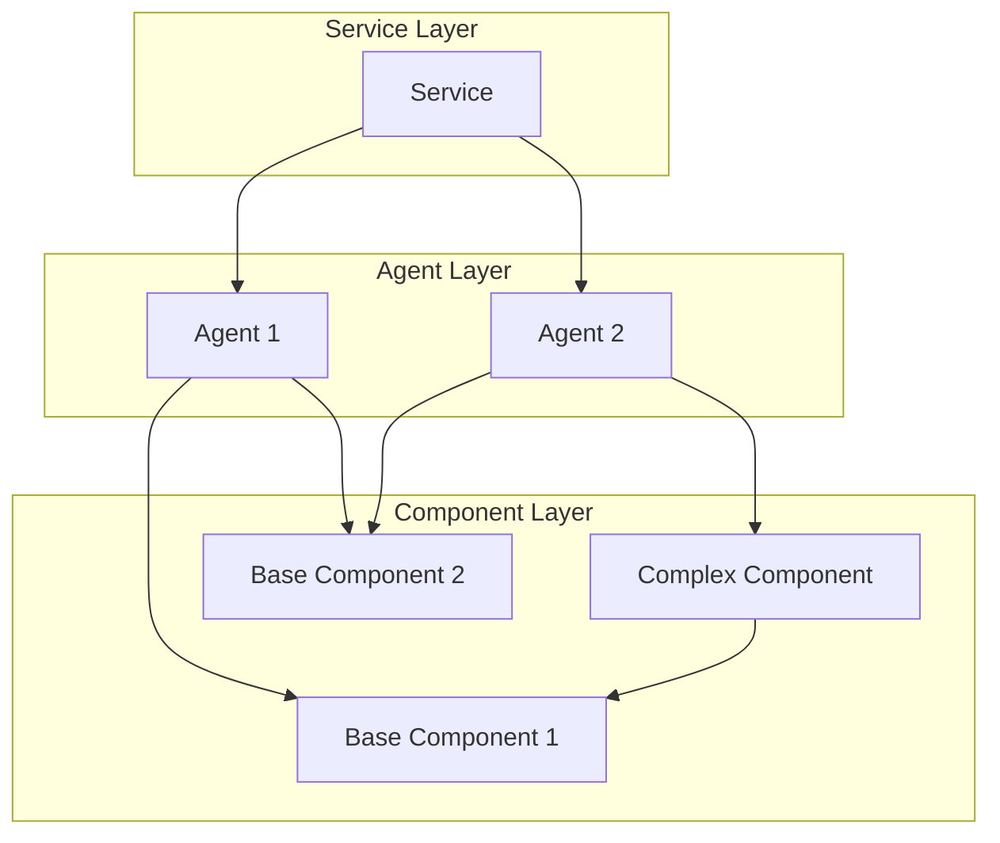
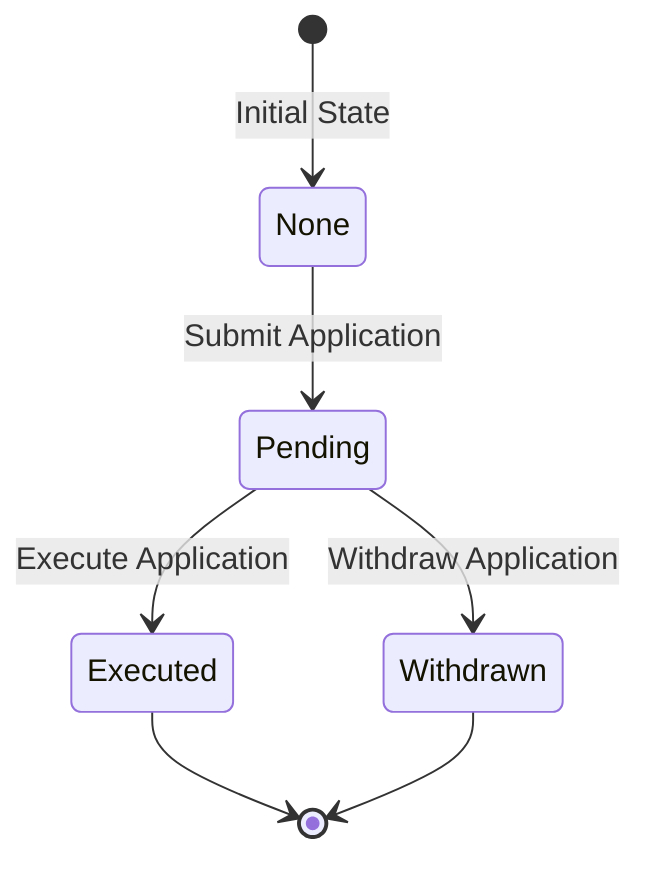
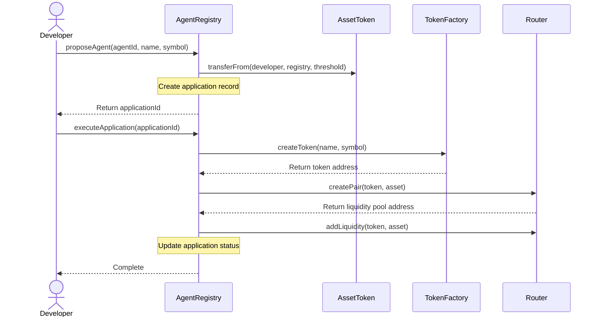
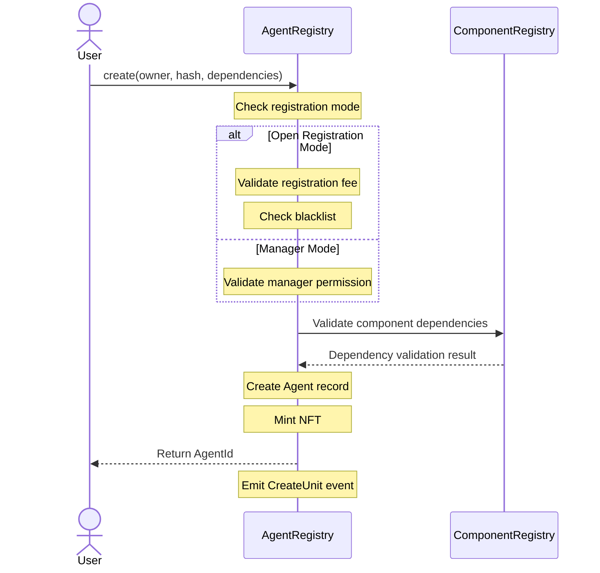

# AI Agent Registry Management Guide

## Architecture Overview

### Component-Agent-Service Relationship

In the Autonolas ecosystem, there are three main building blocks: Component, Agent, and Service. They form a hierarchical relationship:



1. Component
   - The most basic functional unit
   - Can be basic or complex components
   - Complex components can depend on other basic components

2. Agent
   - Composed of one or more Components
   - Has specific functions and behaviors
   - Can combine different components to implement complex functionality

3. Service
   - Composed of one or more Agents
   - Provides complete business services
   - Coordinates multiple Agents to complete complex tasks

### Agent Registry System

The Agent Registry is a smart contract system for managing the registration and lifecycle of AI agents. The system includes:

1. Basic Functions
   - Agent registration
   - Dependency management
   - Access control
   - Fee management

2. Token System
   - Agent Token creation
   - Liquidity pool management
   - Transaction parameter configuration
   - Bot protection mechanism

## Function Modules

### 1. Registration Management

#### Registration Modes
- Open registration: Anyone can register agents
- Admin mode: Only administrators can register agents

#### Fee Management
- Set registration fees
- Fee collection and withdrawal
- Blacklist management

### 2. Token System

#### Token Creation
- Each Agent can create a dedicated Token
- Customize Token parameters
- Automatic liquidity pool creation

#### Token Parameters
```solidity
struct TokenParams {
    uint256 maxSupply;        // Maximum supply
    uint256 lpSupply;         // Liquidity pool supply
    uint256 vaultSupply;      // Vault supply
    uint256 maxTokensPerWallet; // Maximum tokens per wallet
    uint256 maxTokensPerTxn;    // Maximum tokens per transaction
    uint256 botProtectionDuration; // Bot protection duration
    address vault;            // Vault address
}
```

#### Application Process

1. Application State Transitions


2. Application Interaction Flow


### 3. Agent Creation Process



## Operation Guide

### 1. Basic Commands

```bash
# Deploy contracts
pnpm run deploy:local    # Local network
pnpm run deploy:sepolia  # Sepolia testnet

# Registration management
pnpm run setFee:local PARAM1=0.1     # Set registration fee
pnpm run setMode:local PARAM1=true   # Set registration mode
pnpm run blacklist:local PARAM1=<address> PARAM2=true  # Update blacklist

# Withdraw fees
pnpm run withdraw:local  # Withdraw collected fees
```

### 2. Token System Commands

```bash
# Set Token system
pnpm run token:setSystem:local \
    IMPL=<token_impl_address> \
    ASSET=<asset_token_address> \
    ROUTER=<router_address> \
    THRESHOLD=1.0

# Set Token parameters
pnpm run token:setParams:local \
    MAX_SUPPLY=1000000 \
    LP_SUPPLY=500000 \
    VAULT_SUPPLY=100000 \
    MAX_WALLET=10000 \
    MAX_TXN=1000 \
    BOT_PROTECTION=60 \
    VAULT=<vault_address>
```

### 3. Governance Commands

```bash
# Change manager
pnpm run gov:changeManager:local ADDR=<new_manager_address>

# Change owner
pnpm run gov:changeOwner:local ADDR=<new_owner_address>
```

## Best Practices

### 1. Agent Development
- Carefully plan component dependencies
- Ensure component compatibility
- Test functionality completeness
- Optimize Gas usage

### 2. Token Management
- Set reasonable Token parameters
- Ensure sufficient liquidity
- Implement effective bot protection
- Regular monitoring of trading activity

### 3. Security Considerations
- Validate all parameters
- Protect private keys
- Monitor abnormal transactions
- Implement emergency plans

## Common Issues

### 1. Registration Issues
- Insufficient fees
- Invalid dependencies
- Blacklist restrictions
- Insufficient permissions

### 2. Token Issues
- Parameter setting errors
- Insufficient liquidity
- Bot attacks
- Transaction failures

### 3. Governance Issues
- Permission change failures
- Parameter update errors
- Operation timing issues
- Network delays

## Technical Support

- GitHub Issues: [Repository URL]
- Discord: [Discord Channel]
- Email: [Support Email]

## API Documentation

For detailed API documentation, please visit: [API Documentation URL] 