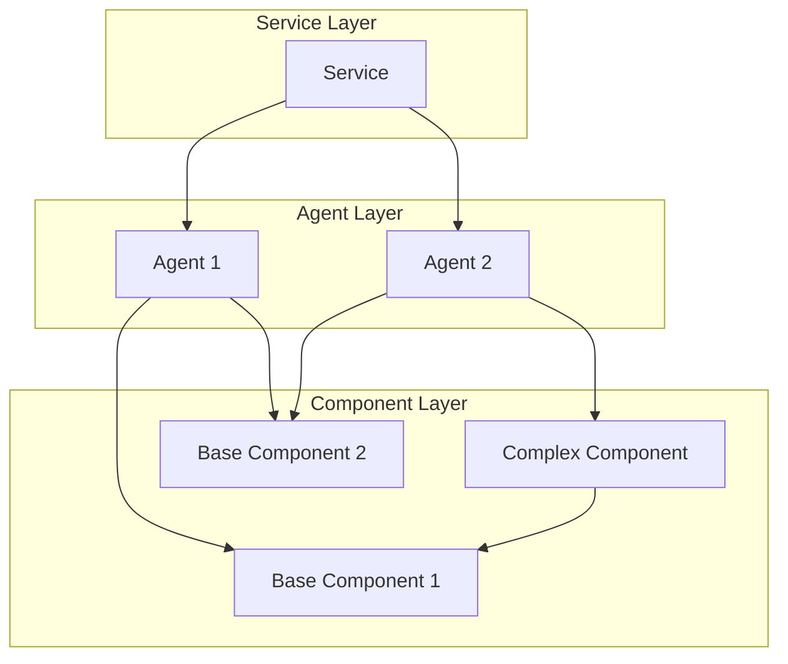
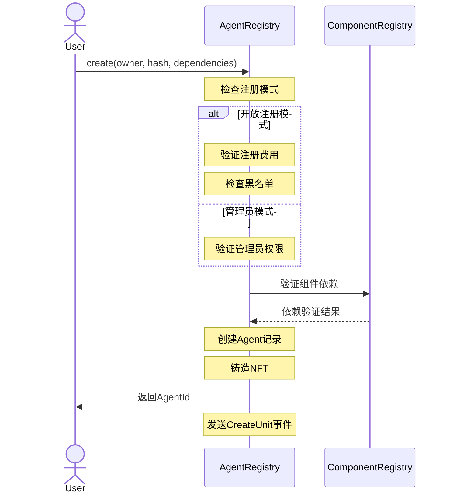
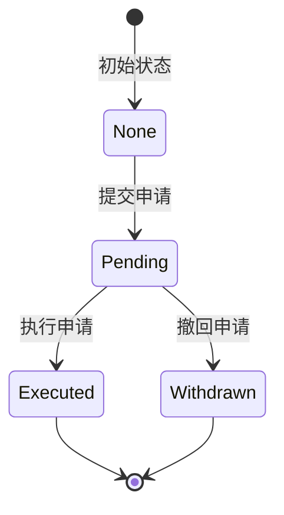
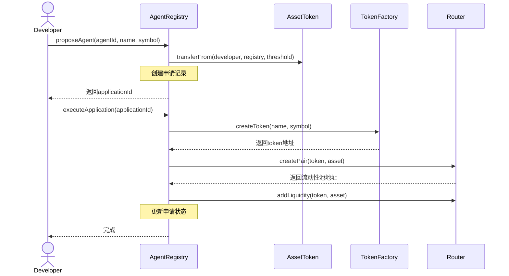

# AI Agent Registry 管理指南

## 架构概述

### Component-Agent-Service 关系

存在三个主要的构建块：Component、Agent和Service。它们形成了一个层级关系：



1. Component（组件）
   - 最基础的功能单元
   - 可以是基础组件或复杂组件
   - 复杂组件可以依赖其他基础组件

2. Agent（代理）
   - 由一个或多个Component组成
   - 具有特定的功能和行为
   - 可以组合不同的组件实现复杂功能

3. Service（服务）
   - 由一个或多个Agent组成
   - 提供完整的业务服务
   - 协调多个Agent完成复杂任务

### Agent Registry 系统

Agent Registry是一个智能合约系统，用于管理AI代理的注册和生命周期。系统包括：

1. 基础功能
   - 代理注册
   - 依赖管理
   - 权限控制
   - 费用管理

2. Token系统
   - Agent Token创建
   - 流动性池管理
   - 交易参数配置
   - 机器人保护机制

### Agent创建流程



## 功能模块

### 1. 注册管理

#### 注册模式
- 开放注册：任何人都可以注册代理
- 管理员模式：只有管理员可以注册代理

#### 费用管理
- 设置注册费用
- 费用收取和提取
- 黑名单管理

### 2. Agent Token系统

#### Token创建
- 每个Agent可以创建专属Token
- 自定义Token参数
- 流动性池自动创建

#### Token参数
```solidity
struct TokenParams {
    uint256 maxSupply;        // 最大供应量
    uint256 lpSupply;         // 流动性池供应量
    uint256 vaultSupply;      // 金库供应量
    uint256 maxTokensPerWallet; // 每钱包最大持有量
    uint256 maxTokensPerTxn;    // 每笔交易最大数量
    uint256 botProtectionDuration; // 机器人保护时间
    address vault;            // 金库地址
}
```

#### 申请流程

1. 申请状态流转


2. 申请交互流程



## 操作指南

### 1. 基础命令

```bash
# 部署合约
pnpm run deploy:local    # 本地网络
pnpm run deploy:sepolia  # Sepolia测试网

# 注册管理
pnpm run setFee:local PARAM1=0.1     # 设置注册费用
pnpm run setMode:local PARAM1=true   # 设置注册模式
pnpm run blacklist:local PARAM1=<地址> PARAM2=true  # 更新黑名单

# 提取费用
pnpm run withdraw:local  # 提取已收取的费用
```

### 2. Token系统命令

```bash
# 设置Token系统
pnpm run token:setSystem:local \
    IMPL=<token_impl_address> \
    ASSET=<asset_token_address> \
    ROUTER=<router_address> \
    THRESHOLD=1.0

# 设置Token参数
pnpm run token:setParams:local \
    MAX_SUPPLY=1000000 \
    LP_SUPPLY=500000 \
    VAULT_SUPPLY=100000 \
    MAX_WALLET=10000 \
    MAX_TXN=1000 \
    BOT_PROTECTION=60 \
    VAULT=<vault_address>
```

### 3. 治理命令

```bash
# 更改管理员
pnpm run gov:changeManager:local ADDR=<new_manager_address>

# 更改所有者
pnpm run gov:changeOwner:local ADDR=<new_owner_address>
```

## 最佳实践

### 1. Agent开发
- 仔细规划组件依赖
- 确保组件兼容性
- 测试功能完整性
- 优化Gas使用

### 2. Token管理
- 合理设置Token参数
- 确保流动性充足
- 实施有效的机器人保护
- 定期监控交易活动

### 3. 安全考虑
- 验证所有参数
- 保护私钥安全
- 监控异常交易
- 实施应急预案

## 常见问题

### 1. 注册问题
- 费用不足
- 依赖无效
- 黑名单限制
- 权限不足

### 2. Token问题
- 参数设置错误
- 流动性不足
- 机器人攻击
- 交易失败

### 3. 治理问题
- 权限变更失败
- 参数更新错误
- 操作时序问题
- 网络延迟

## 技术支持

- GitHub Issues: [Repository URL]
- Discord: [Discord Channel]
- Email: [Support Email]

## API文档

详细的API文档请访问：[API Documentation URL] 