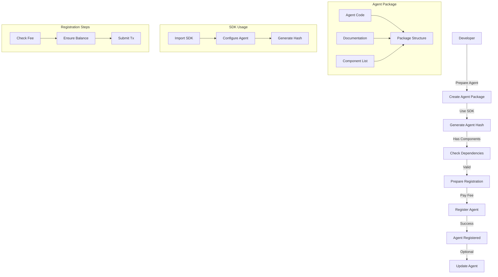

# AI Agent Registry Management

## Overview

The AI Agent Registry is a smart contract system that allows developers to register their AI agents for the hackathon. The system provides a secure and transparent way to register agents while maintaining quality through a fee-based registration mechanism.

## Registration Flows

### Participant Registration Flow



## Using the SDK

### Installation

```bash
npm install @pin-ai/agent-registry-sdk
```

### Basic Usage

```javascript
const { AgentRegistrySDK } = require('@pin-ai/agent-registry-sdk');

// Initialize SDK
const sdk = new AgentRegistrySDK({
    agentPath: './my-agent',
    components: [1, 2, 3] // Component IDs your agent depends on
});

// Generate agent hash
const agentHash = await sdk.generateHash();

// Register agent
const tx = await sdk.registerAgent(agentHash, {
    value: registrationFee // Registration fee in ETH
});
```

## Function Interface

### For Participants

1. Register Agent
```solidity
function create(
    address unitOwner,
    bytes32 unitHash,
    uint32[] memory dependencies
) external payable returns (uint256 unitId)
```
- `unitOwner`: Owner address of the agent
- `unitHash`: Hash generated by the SDK
- `dependencies`: Array of component IDs (must be sorted)
- Returns: Unique ID of the registered agent

2. Update Agent
```solidity
function updateHash(
    address unitOwner,
    uint256 unitId,
    bytes32 unitHash
) external returns (bool success)
```
- `unitOwner`: Current owner of the agent
- `unitId`: Agent ID to update
- `unitHash`: New hash generated by the SDK
- Returns: Success status

## Best Practices

### For Participants

1. **Agent Package Structure**
   - Follow SDK package structure
   - Include comprehensive documentation
   - List all component dependencies
   - Test agent functionality locally

2. **Component Dependencies**
   - Verify component availability
   - Use correct component IDs
   - Sort dependencies in ascending order
   - No duplicate components

3. **Registration Process**
   - Check current registration fee
   - Ensure sufficient balance
   - Verify transaction success
   - Save agent ID for future updates

4. **Updates and Maintenance**
   - Test changes thoroughly
   - Update documentation
   - Generate new hash via SDK
   - Verify ownership before updates

## Common Issues and Solutions

1. **Registration Failures**
   - Insufficient fee
   - Invalid component dependencies
   - Incorrect hash format
   - Unsorted dependencies

2. **SDK Issues**
   - Invalid package structure
   - Missing dependencies
   - Configuration errors
   - Hash generation failures

3. **Component Dependencies**
   - Missing components
   - Incompatible versions
   - Incorrect ordering
   - Duplicate entries

## Technical Details

### Contract Addresses

- ComponentRegistry: [To be deployed]
- AgentRegistry: [To be deployed]

### Network Information

- Network: [Network details]
- Block Explorer: [Explorer URL]

### Gas Considerations

- Registration: ~235,000 gas
- Update: ~50,000 gas

## Support

For technical support during the hackathon:
- GitHub Issues: [Repository URL]
- Discord: [Discord Channel]
- Email: [Support Email]

## SDK Documentation

For detailed SDK documentation, please visit:
[SDK Documentation URL] 