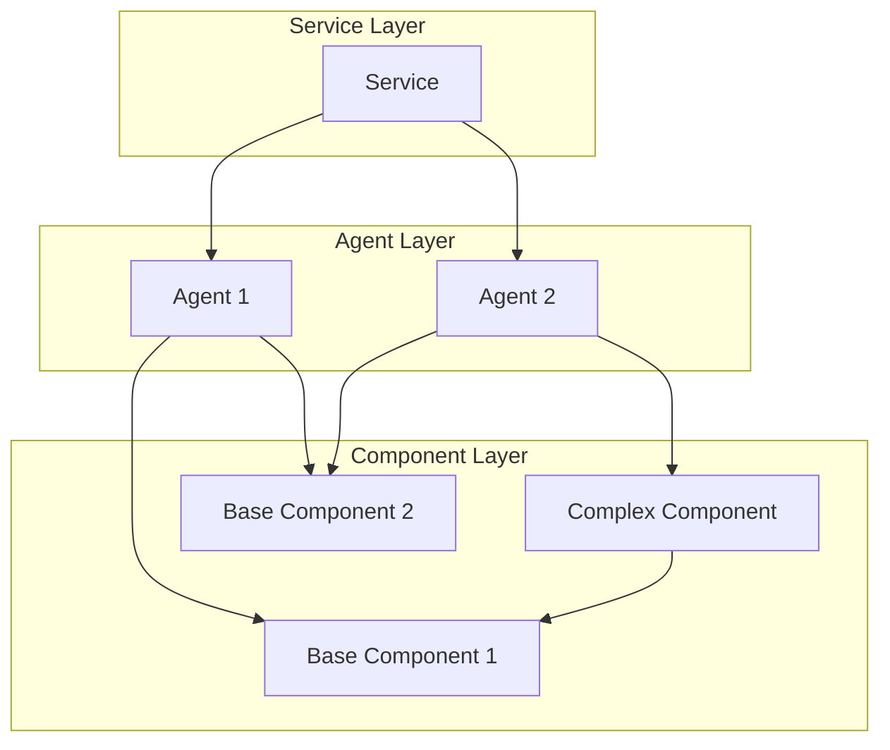
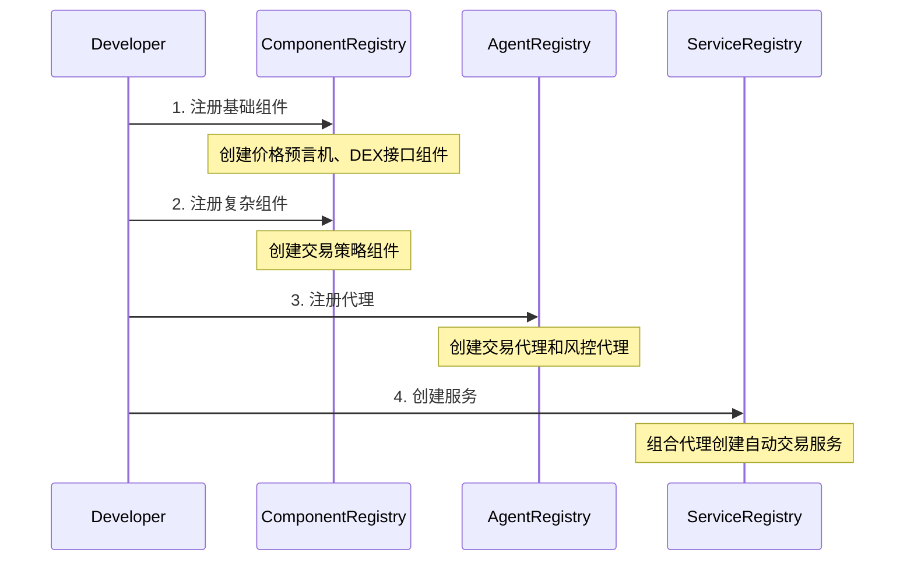

```
从代码中可以看到:
1. Component是最基础的功能单元
2. Agent由一个或多个Component组成
3. Service由一个或多个Agent组成

关键特点:
1. 层级关系: Component -> Agent -> Service
2. 依赖关系是单向的
3. 每一层都有自己的注册表合约
4. 使用NFT管理所有权

让我通过一个实际的例子来说明这种关系。

```

### 架构关系



### 实际例子：DeFi自动化交易服务

假设我们要构建一个自动化DeFi交易服务，其组成如下：

1. 基础组件(Components):

```solidity
// 价格预言机组件
struct PriceOracleComponent {
    bytes32 unitHash;  // IPFS配置哈希
    uint32[] dependencies; // 无依赖
}

// DEX接口组件
struct DexInterfaceComponent {
    bytes32 unitHash;
    uint32[] dependencies; // 无依赖
}

// 交易策略组件
struct TradingStrategyComponent {
    bytes32 unitHash;
    uint32[] dependencies; // 依赖价格预言机和DEX接口组件
}

```

1. 交易代理(Agent):

```solidity
// 自动交易代理
struct TradingAgent {
    bytes32 unitHash;
    uint32[] dependencies; // 依赖交易策略组件
}

// 风控代理
struct RiskManagementAgent {
    bytes32 unitHash;
    uint32[] dependencies; // 依赖价格预言机组件
}

```

1. 自动化交易服务(Service):

```solidity
struct AutoTradingService {
    address[] agentInstances; // 包含交易代理和风控代理的实例
    uint32[] agentIds;       // 代理ID列表
    bytes32 configHash;      // 服务配置哈希
}

```

### 工作流程



### 关键特性

1. 模块化
- 组件可重用
- 代理可组合
- 服务可配置
1. 可扩展性
- 新组件可以基于现有组件构建
- 新代理可以使用不同组件组合
- 服务可以灵活组合不同代理
1. 安全性
- 每层都有权限控制
- NFT管理所有权
- 依赖关系验证

这种分层设计允许:

1. 功能的逐级组合
2. 清晰的职责划分
3. 灵活的系统扩展
4. 可重用的代码基础
